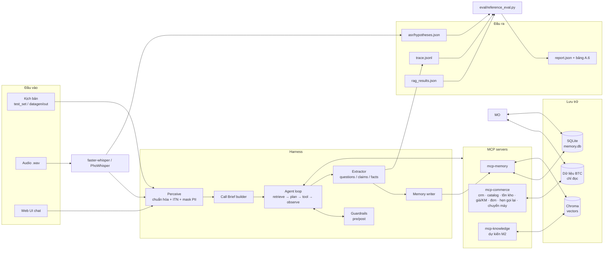
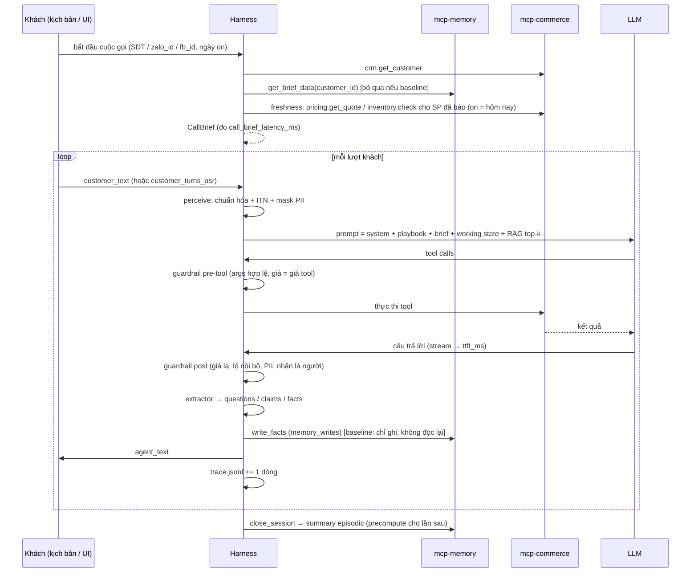

# Kiến trúc hệ thống — Harness Agent Call Center (Vòng 1)

Tài liệu thiết kế: dữ liệu được lưu ở đâu, harness xử lý một lượt thoại như thế nào, và file đi từ đâu đến đâu, từ dữ liệu BTC tới bảng A.6.
Mọi định dạng vào/ra bám theo `schemas/` của BTC: `trace_log`, `call_brief`, `handoff_brief`, `tools`.

---

## 1. Tổng quan



Nguyên tắc xuyên suốt:
1. **Giá / KM / tồn kho chỉ đến từ tool.** Các tool bọc `eval/mock_tools.py` (logic tham chiếu của BTC). LLM không bao giờ tự sinh con số.
2. **Bộ nhớ là dữ liệu có cấu trúc + nguồn gốc**, không phải lịch sử chat nhồi vào prompt. Mỗi fact biết nó đến từ cuộc gọi, lượt nào, đã bị thay bởi giá trị nào, hết hạn khi nào.
3. **Baseline và full dùng chung code.** Chúng chỉ khác nhau ở cờ `memory_read`, đúng điều kiện ở mục A.6 của đề.

---

## 2. Phân loại dữ liệu và nơi lưu

| Loại dữ liệu | Ví dụ | Tính chất | Lưu ở | Ai ghi |
|---|---|---|---|---|
| Dữ liệu BTC | `catalog/*.json`, `policy/*.md`, `crm_seed.json` | tĩnh, chỉ đọc | file gốc trong repo | không ai |
| Trạng thái nghiệp vụ mock | đơn tạo mới, lịch gọi lại, ticket chuyển máy | thay đổi trong phiên chạy | SQLite `orders`, `callbacks`, `handoffs` | mcp-crm-order |
| Working memory | slot đang chờ xác nhận, giỏ hàng tạm, bước hiện tại | sống trong 1 cuộc gọi | RAM (`CallState`) + snapshot `turns.state_json` | harness |
| Episodic memory | "Cuộc 1 (15/10): tư vấn AP-Y 5,2tr, chờ hỏi chồng" | 1 bản ghi / cuộc gọi | SQLite `sessions` + vector `episodes` | memory writer (cuối cuộc) |
| Profile memory | phòng 25 m², có con nhỏ, size 41, địa chỉ | bền, có thể bị thay, có TTL | SQLite `facts` | memory writer (mỗi lượt) |
| Cam kết / báo giá | đã báo AP-Y 5.200.000đ kèm GIFT-FILTER | có hạn theo KM | SQLite `quotes` | memory writer (khi tool trả giá) |
| Semantic / KB | 99 chunk `[XX-nn]` của `policy/` | tĩnh, có phiên bản | Chroma `policy_chunks` (+ metadata hiệu lực) | script index |
| PII thật | CCCD, STK, SĐT đầy đủ | nhạy cảm | SQLite `pii_vault` (tách bảng, chỉ mcp-crm-order đọc) | perceive/masker |
| Log chấm điểm | từng lượt agent | append-only | `runs/<run_id>/trace.jsonl` | trace writer |
| Cải tiến | knowledge gap, exemplar, bài học, đề xuất sửa | cần người duyệt | SQLite `improvements` + `kb_overrides/*.md` | vòng cải tiến |

**Vì sao chọn SQLite + Chroma:** chạy local không cần server, một file dễ reset (mỗi kịch bản một bản sạch), SQL đủ cho truy vấn "fact hiện hành của khách X", còn Chroma lo tìm kiếm ngữ nghĩa. Sau này muốn mở rộng thì SQLite → Postgres + pgvector giữ nguyên schema (tiêu chí 7).

---

## 3. Schema SQLite (`memory.db`)

```sql
-- ---------- danh tính (identity resolution: SĐT / Zalo / FB, ca chung SĐT)
CREATE TABLE customers (
  customer_id   TEXT PRIMARY KEY,          -- C001… (CRM seed) hoặc N… (khách mới)
  name          TEXT, honorific TEXT, region TEXT,
  status        TEXT DEFAULT 'active',     -- active | deletion_requested | deleted
  created_at    TEXT
);
CREATE TABLE identities (                  -- 1 khách nhiều định danh; 1 SĐT có thể thuộc ≥2 khách
  kind          TEXT CHECK (kind IN ('phone','zalo_id','fb_id')),
  value         TEXT,
  customer_id   TEXT REFERENCES customers,
  verified      INTEGER DEFAULT 0,         -- đã xác nhận bằng lời ("chị là Dung")
  PRIMARY KEY (kind, value, customer_id)
);

-- ---------- episodic
CREATE TABLE sessions (
  session_id    TEXT PRIMARY KEY,          -- <scenario>:<call> khi chạy eval
  customer_id   TEXT REFERENCES customers,
  channel       TEXT, channel_identity TEXT,
  started_on    TEXT,                      -- ngày của cuộc gọi (tham số `on`)
  outcome       TEXT,                      -- hen_goi_lai | chot_don | tu_choi | chuyen_may | khac
  summary       TEXT,                      -- tóm tắt episodic (precompute cuối cuộc)
  blockers_json TEXT, next_action TEXT
);
CREATE TABLE turns (
  session_id    TEXT REFERENCES sessions, turn INTEGER,
  customer_text_masked TEXT, agent_text TEXT,
  input_mode    TEXT,                      -- clean | asr_transcript | chat_teencode
  state_json    TEXT,                      -- snapshot working memory sau lượt
  PRIMARY KEY (session_id, turn)
);

-- ---------- profile (fact có nguồn gốc, thay thế, TTL)
CREATE TABLE facts (
  fact_id       INTEGER PRIMARY KEY,
  customer_id   TEXT REFERENCES customers,
  slot          TEXT,                      -- room_area_m2, budget_vnd, size, color, address, product_interest…
  value_json    TEXT,
  confidence    REAL,                      -- 1.0 khách nói rõ / 0.6 suy ra / 0.3 từ ASR nhiễu
  source        TEXT,                      -- "call_1#turn3" (provenance)
  session_id    TEXT REFERENCES sessions,
  valid_from    TEXT,                      -- ngày ghi
  expires_on    TEXT,                      -- TTL theo slot (bảng 3.1)
  superseded_by INTEGER REFERENCES facts,  -- khách đổi ý → trỏ sang fact mới, không xóa
  status        TEXT DEFAULT 'current'     -- current | superseded | expired | disputed | deleted
);
CREATE INDEX facts_current ON facts(customer_id, slot) WHERE status = 'current';

-- ---------- báo giá / cam kết (để phát hiện KM hết hạn, giá đổi)
CREATE TABLE quotes (
  quote_id      INTEGER PRIMARY KEY,
  customer_id   TEXT, session_id TEXT,
  sku           TEXT,                      -- variant_sku nếu có
  role          TEXT,                      -- advised | alternative | chosen  (bài học D01: AP-Y vs AP-X)
  list_price_vnd INTEGER, final_price_vnd INTEGER,
  promo_code    TEXT, promo_end TEXT,
  quoted_on     TEXT, channel TEXT
);

-- ---------- trạng thái nghiệp vụ mock (thay cho dict trong RAM của mock_tools)
CREATE TABLE orders    (order_id TEXT PRIMARY KEY, customer_id TEXT, sku TEXT, qty INTEGER, price_vnd INTEGER,
                        promo_code TEXT, payment TEXT, address_masked TEXT, status TEXT, created_on TEXT, eta TEXT);
CREATE TABLE callbacks (callback_id TEXT PRIMARY KEY, customer_id TEXT, callback_at TEXT, moved_from TEXT, note TEXT);
CREATE TABLE handoffs  (ticket_id TEXT PRIMARY KEY, session_id TEXT, brief_json TEXT, created_at TEXT);

-- ---------- PII (tách riêng; log/prompt chỉ thấy token)
CREATE TABLE pii_vault (token TEXT PRIMARY KEY, customer_id TEXT, kind TEXT, value_enc TEXT);

-- ---------- vòng cải tiến (có người duyệt)
CREATE TABLE improvements (
  id INTEGER PRIMARY KEY, kind TEXT,       -- knowledge_gap | exemplar | lesson | playbook
  payload_json TEXT, source_run TEXT, source_ref TEXT,
  status TEXT DEFAULT 'pending',           -- pending | approved | rejected | rolled_back
  reviewer TEXT, decided_at TEXT
);
```

### 3.1 Quy tắc ghi bộ nhớ (memory policy)

| Slot | Ghi khi | TTL | Ghi chú |
|---|---|---|---|
| `room_area_m2`, `has_children`, `household_size` | khách nói rõ | 12 tháng | profile bền |
| `budget_vnd` | khách nói | 3 tháng | ý định mua nguội nhanh |
| `size`, `color` | khách chốt | 6 tháng | đổi ý → `supersede` |
| `address` | khách đọc / xác nhận | 6 tháng | quá TTL → hỏi **xác nhận**, không hỏi mở (T10) |
| `product_interest` / `quotes` | tool trả giá | tới `promo_end` | hết hạn → `stale_warnings` trong brief |
| `blocker` | khách nêu ("hỏi chồng") | tới cuộc sau | đóng khi khách báo đã giải quyết |
| CCCD / STK | **không bao giờ** ghi vào `facts` | — | chỉ vào `pii_vault`, trace chỉ có token |
| câu xã giao, ý kiến chủ quan | không ghi | — | tránh nhồi rác |

Thao tác ghi đúng như `memory_writes` trong trace: `{"key","value","op":"set|supersede|delete","source":"call_1#turn3","customer_id"}`.
- **Khách đổi ý:** fact cũ chuyển `superseded`, `superseded_by` trỏ sang fact mới. Không bao giờ có hai giá trị `current` cho cùng một slot.
- **Chung SĐT (T11):** mọi lệnh ghi phải có `customer_id` đã xác định. Nếu `crm.get_customer` trả `ambiguous` thì chưa ghi, agent phải hỏi xác nhận danh tính trước.
- **Chống đầu độc:** nếu giá trị mới mâu thuẫn với nguồn đáng tin hơn (ví dụ khách nói "hôm trước em báo 4 triệu" trong khi `quotes` ghi 5,2 triệu), đánh dấu `disputed` và kiểm lại bằng tool, không ghi đè.
- **Yêu cầu xóa dữ liệu (T17):** `customers.status = deletion_requested`, xóa `facts` và `pii_vault` của khách đó, trace ghi `profile_state`.

### 3.2 Vector store (Chroma)

| Collection | Nội dung | Metadata | Dùng cho |
|---|---|---|---|
| `policy_chunks` | 99 chunk `[XX-nn]` | `doc`, `chunk_id`, `effective_from/to`, `restricted` (tài liệu NỘI BỘ), `superseded_doc` | RAG, Recall@k, version conflict |
| `episodes` | tóm tắt từng session | `customer_id`, `date`, `outcome` | tìm phiên liên quan khi lịch sử dài |
| `exemplars` | cuộc gọi chốt thành công đã duyệt | `persona`, `objection`, `category` | few-shot (Exemplar Bank) |

Chunk có `restricted=true` (giá nhập, nhà cung cấp) **chỉ** được trả cho câu hỏi về ngày hàng về, và không bao giờ đi vào lời agent (guardrail kiểm lại ở đầu ra).

---

## 4. Kiến trúc harness

### 4.1 Thành phần

```
harness/
  loader.py         # đọc kịch bản → CHỈ lộ lượt khách, kênh, ngày; ẩn facts_established/ground_truth/success_if/_meta
  perceive.py       # chuẩn hóa teencode/không dấu, ITN số tiền/SĐT/ngày tương đối, mask PII
  identity.py       # SĐT/Zalo/FB → customer_id | ambiguous | new
  brief.py          # Call Brief (schemas/call_brief.schema.json)
  agent.py          # vòng lặp LLM + tool (function calling)
  guardrails.py     # pre-tool, post-response
  extractor.py      # questions[] / claims[] / facts (regex + LLM, cấu hình được)
  memory_writer.py  # memory policy mục 3.1
  trace.py          # ghi JSONL đúng schemas/trace_log.schema.json
mcp_servers/                # ĐÃ CÀI (mục 4.5)
  common.py             # khung server stdio (mcp SDK lowlevel), inputSchema tự khai báo
  commerce_server.py    # mcp-commerce: 9 tool BTC (crm.get_customer, catalog.search, inventory.check, pricing.get_quote,
                        #   order.create/status/update, schedule.callback, handoff.transfer) — bọc eval/mock_tools.py
  memory_server.py      # mcp-memory: memory.lookup/status/past_sessions/current_facts/past_quotes (đọc)
                        #   + upsert_customer/write_fact/add_session/log_turn/add_quote/merge_customer/forget_customer/... (ghi)
  (knowledge_server.py) # mcp-knowledge: policy.search — dự kiến M2, cùng lúc với RAG vector
run_eval.py         # lệnh BTC yêu cầu
app/                # FastAPI + Streamlit UI
```

Chọn **MCP** (bắt buộc có `mcp-memory`), không làm A2A ở M1. Lý do: bộ nhớ và nghiệp vụ là dữ liệu dùng chung giữa bot, nhân viên và UI. Đóng gói thành server thì UI, agent và vòng cải tiến đều gọi cùng một cửa, và phân quyền được theo tool (chỉ `mcp-memory` được ghi `facts`). Chi tiết đã cài ở mục 4.5.

### 4.2 Luồng một cuộc gọi



### 4.3 Chi tiết từng bước

**Perceive.** Nếu kịch bản có `customer_turns_asr` thì dùng bản đó (bắt buộc). Tiếp theo:
- teencode → chuẩn ("k" → "không", "sp" → "sản phẩm");
- ITN: "năm triệu rưỡi" → 5500000, "thứ hai tuần sau" → ngày cụ thể tính từ `on`;
- từ điển tên sản phẩm ("e pia y" → AirPure Y);
- mask CCCD/STK → token.

**Call Brief.** Precompute: `sessions.summary`, danh sách `must_not_ask` (các slot đang `current` và chưa quá TTL). Lúc nhận diện chỉ chạy phần kiểm tra tính mới: re-quote các SKU trong `quotes`, kiểm tồn kho, xem có session kênh khác sau lần cuối không. Câu mở đầu dựng từ template, không cần LLM, để giữ ≤ 5 s.

**Prompt (đưa gì vào, cắt gì).**

| Phần | Đưa vào | Cắt khi dài |
|---|---|---|
| system | vai trò, xưng hô, luật giá chỉ từ tool | không bao giờ |
| playbook | đoạn xử lý phản đối liên quan | không bao giờ |
| Call Brief | bản rút gọn | không bao giờ |
| working state | slot đã biết, bước hiện tại | không bao giờ |
| lượt gần nhất | N lượt | các lượt cũ → tóm tắt |
| RAG | top-3 | top-3 → top-1 |
| exemplar | 1 mẫu | 1 → 0 |

Toàn bộ lịch sử phiên cũ **không** đưa vào, chỉ có brief.

**Guardrails.**

| Kiểm tra | Khi nào | Xử lý |
|---|---|---|
| Mọi số tiền trong câu trả lời phải xuất hiện trong kết quả tool của cuộc này | post | sửa câu / gọi lại tool |
| Không lộ giá nhập, nhà cung cấp (`money_regex` giá nhập, chunk restricted) | post | chặn, trả lời theo playbook |
| PII (regex CCCD 12 số, STK 10–14 số) không nằm trong agent_text, memory_writes, tool args | post + trước khi ghi | mask |
| Khách hỏi "em là người hay máy" → không nhận là người | post | thay câu chuẩn |
| Không bình luận giá đối thủ | post | câu playbook |
| `order.create` phải đúng giá quote hiện hành, không vượt COD 10 triệu | pre-tool | từ chối gọi, giải thích |
| Câu hỏi y tế / ngoài tài liệu | plan | `handoff.transfer` với HandoffBrief đủ trường |

**Fallback.**

| Lỗi | Xử lý |
|---|---|
| tool timeout | retry 1 lần → nói "em kiểm tra lại và gọi lại anh/chị" + `schedule.callback` |
| LLM trả sai JSON | parse lại hoặc dùng câu template an toàn |
| ASR rác (độ tin thấp) | hỏi xác nhận, không ghi fact |

**Extractor.** Tách `questions[]` (gán slot, open/confirm), `claims[]` (field/value) và các fact mới. Làm hai tầng: regex/từ điển trước (rẻ, tái lập được), LLM sau cho phần còn lại. BTC chấm tay extractor, nên cách trích phải mô tả trong báo cáo, và output của extractor không được "ăn gian" để làm đẹp RQR/HR.

### 4.4 Baseline và full

| Cấu hình | Đọc bộ nhớ phiên trước | Ghi bộ nhớ | CRM (tên, đơn) | Mọi thứ khác |
|---|---|---|---|---|
| `baseline_no_memory` | ✗ (brief rỗng, `facts`/`sessions`/`quotes` không đọc) | ✓ (để trace có `memory_writes`) | ✓ | giống hệt |
| `full` | ✓ | ✓ | ✓ | giống hệt |

---

### 4.5 MCP — đã cài

```
harness (run_eval.py / UI)                      tiến trình con, stdio, JSON-RPC
  ToolBox.call(name, args) ──── MCP client ───► mcp-commerce  ──► eval/mock_tools.py (logic tham chiếu BTC)
  RemoteMemory.<method>(…) ──── MCP client ───► mcp-memory    ──► harness/memory.py ──► SQLite / Postgres
```

- **Chọn đường đi:** `TOOL_TRANSPORT=mcp` (mặc định) hoặc `run_eval.py --transport mcp|direct`. `direct` gọi hàm Python trực tiếp, giữ lại để so sánh và làm phương án dự phòng.
- **Schema:** `mcp-commerce` khai báo `inputSchema` lấy từ `schemas/tools.schema.json` (kiểu, enum `payment`, tham số bắt buộc) cộng tham số tùy chọn của mock (`on`, `basket_skus`…). SDK kiểm tra trước khi chạy tool, nên lời gọi sai kiểu bị từ chối với thông điệp rõ ràng thay vì lỗi Python.
- **Phân quyền:** `MCP_MEMORY_MODE=ro` chỉ mở 5 tool đọc. Dùng cho giao diện xem dòng thời gian bộ nhớ và QA. Agent chạy `rw`.
- **Trạng thái:** trạng thái runtime của mock (đơn, lịch gọi lại, ticket) sống trong tiến trình `mcp-commerce`; `world.reset` xóa giữa các kịch bản. Mỗi tiến trình harness (kể cả mỗi worker khi `--workers N`) tự mở server riêng nên không lẫn trạng thái. `mcp-memory` không giữ trạng thái, mọi thứ ở DB, phân tách theo `ns`.
- **Giữ ngoài MCP:** dữ liệu catalog **tĩnh** (tên, biến thể, danh sách KM, ngày nghỉ) đọc trực tiếp để hiểu câu khách nói (NLU). Mọi thao tác có trạng thái hoặc phụ thuộc ngày đều đi qua tool.

**Số đo** (`tests/mcp_parity.py`, router `rules`, generator `offline`, 7 SAMPLE + 45 dev + 22 test, cả `full` và `baseline`):

| | Kết quả |
|---|---|
| Trace MCP so với direct | 870/870 lượt giống hệt (trừ trường thời gian) → mọi chỉ số chấm như nhau |
| Độ trễ thêm mỗi lượt | trung vị ~35 ms, p95 ~85 ms (ngưỡng TTFT 3 s) |
| Call Brief qua MCP | p50 61 ms, p95 84 ms (ngưỡng 5 s) |
| `tests/mcp_check.py` | đủ 9 tool BTC; từ chối sai kiểu/thiếu tham số/tham số lạ/payment ngoài enum; kết quả = gọi trực tiếp; supersede khi khách đổi ý; baseline không đọc được; `ro` không ghi được |

**Một tình huống MCP giúp ích cụ thể (Case 3, bàn giao):** giao diện cho nhân viên mở `mcp-memory` ở chế độ `ro` và thấy đúng bộ nhớ agent vừa ghi (fact, nguồn `call_1#turn3`, phiên trước), cùng một cửa, không cần copy dữ liệu, và không thể vô tình ghi đè. Khi thay mock bằng hệ thống CRM/đơn thật, chỉ thay `mcp-commerce`, harness không đổi.

### 4.6 PII khi gọi model ngoài

`core/pii.py`: trước khi gửi DeepSeek/Jev, SĐT và địa chỉ được thay bằng mã `[SĐT_1]`, `[ĐỊA_CHỈ_1]` (theo giá trị đã biết trong dữ liệu lượt, theo regex SĐT, theo cụm dẫn "giao về…/giờ ở…", và theo mẫu "số nhà Tên, Quận, Tỉnh"). Câu trả lời được ghép lại giá trị thật. CCCD/STK đã che từ lúc nhận câu nói và không khôi phục. File log che SĐT (`098****714`) và địa chỉ trên mọi dòng; trace JSONL cho BTC chấm giữ nguyên.

Kiểm tra (`tests/pii_check.py` trên 45 kịch bản dev, qua API giả lập): 544 request gửi ra ngoài, 0 SĐT và 0 địa chỉ lọt; câu trả lời sau khi ghép lại trùng 263/263 lượt với bản không che; file log không còn PII nguyên văn.

## 5. Luồng file dữ liệu

### 5.1 Chấm hội thoại (chỉ số chính)

```
test_set/public_sample/*.json  ┐
datagen/out/{dev,test}/*.json  ┼─► run_eval.py --scenarios <dir> --config full|baseline_no_memory --out runs/<id>/<config>.jsonl
<bộ ẩn của BTC>/*.json         ┘        │
                                         │  với mỗi kịch bản:
                                         │    1. copy memory.db sạch ← seed từ catalog/crm_seed.json + seed_history của kịch bản
                                         │    2. call_1..call_n theo ngày (call_date / days_later) → tool nhận on=<ngày>
                                         │    3. mỗi lượt khách → 1 dòng trace
                                         ▼
runs/<id>/full.jsonl + baseline.jsonl ─► eval/reference_eval.py --scenarios <dir> --trace full.jsonl --baseline baseline.jsonl
                                         ▼
                                   runs/<id>/report.json  +  bảng A.6 (RQR, CCR, TSR, HR, lượt TB, guardrail, latency)
```

- **Reset bộ nhớ theo kịch bản**, không theo cả bộ: các kịch bản dùng lại SĐT (T10/T11, SAMPLE) nên nếu dùng chung DB sẽ nhiễm chéo.
- **Loader là lá chắn chống rò đáp án:** agent chỉ nhận `customer_turns` / `customer_turns_asr`, `channel`, `channel_identity`, ngày và SĐT. `seed_history` được nạp vào DB như lịch sử CRM thật, không đưa thẳng vào prompt.
- Trong `runs/<id>/` giữ thêm `config.json` (model, tham số, seed, commit hash) để số liệu tái lập được.

### 5.2 ASR

```
asr/audio/*.wav (+ ≥ 20 file của team) ─► asr/transcribe.py: faster-whisper | PhoWhisper (local, initial_prompt = tên sản phẩm)
                                          ─► asr/itn.py: itn() chữ → số (tiền, SĐT, ngày, mã đơn, COD)
                                          ─► entities() theo từng segment, giá trị nhắc sau ghi đè giá trị trước
                                          ─► to_spoken() đưa transcript về dạng chữ như ground truth
                                          ─► asr/hypotheses.json {"D01": {"text", "text_itn", "entities", "segments"}}
                                          ─► wer_cer() của eval/reference_eval.py → WER / CER / Entity Accuracy (+ riêng tiền, SĐT)
```

Đã cài (tuần 1). Dạng chuẩn hóa để tính WER: **dạng chữ** như ground truth (đầu ra ASR có chữ số được `to_spoken()` đổi lại). Entities cấp hội thoại hiện theo đúng cách BTC gộp (giá trị nhắc sau thắng); khi BTC sửa cách chấm (D01: AP-Y rồi AP-X) sẽ xuất thêm danh sách theo thứ tự. Chưa có diarization (M2) nên không xuất `turns`.

Kiểm thử không cần audio (`--from-ground-truth`): WER 0%, Entity Accuracy 29/29. Giả lập ASR viết chữ số (`--as-digits`): WER 0,5% (chỉ lệch "năm triệu bảy" ↔ "bảy trăm nghìn", "tư" ↔ "bốn"). **Lưu ý:** luật trích được chỉnh trên chính 4 hội thoại này, nên con số chỉ chứng minh pipeline chạy đúng; độ chính xác thật đo trên audio + 8 hội thoại BTC giữ lại.

### 5.3 RAG

```
policy/*.md ─► rag/index.py (tách theo [XX-nn], embed bge-m3, metadata hiệu lực/restricted) ─► Chroma policy_chunks
rag/qa_labeled.json ─► rag/run_retrieval.py ─► rag/rag_results.json ─► reference_eval.py --rag → Recall@3/@5, abstain
```

### 5.4 Vòng cải tiến (vòng 0 → vòng 1 trên cùng bộ test)

```
runs/r0/report.json + trace ─► improve/mine.py ─► improvements (pending)
    ├─ knowledge_gap : câu agent không trả lời được / nói "không có thông tin"
    ├─ exemplar      : cuộc gọi chốt đơn thành công, không vi phạm guardrail
    └─ lesson        : lỗi lặp (hỏi lại slot, báo giá sai)
          │
          ▼  người duyệt (UI / CLI) — approve | reject
kb_overrides/*.md · Chroma exemplars · playbook ─► chạy lại r1 cùng bộ test ─► so r0 vs r1
          ▲                                              │
          └──────── rollback nếu chỉ số tụt ◄────────────┘
```

Khi cải tiến, chỉ dùng `datagen/out/dev` và SAMPLE. `datagen/out/test` chỉ để đo.

### 5.5 Web UI (demo)

```
Streamlit ─HTTP─► FastAPI /call/start (phone|zalo|fb)  → CallBrief (hiển thị ngay)
                         /call/turn  (text | file ghi âm → ASR) → agent_text (stream)
                         /customer/{id}/timeline        → sessions + facts (dòng thời gian bộ nhớ)
                         /call/end                      → summary + outcome
```

UI dùng đúng harness và MCP servers như `run_eval.py`. Khác biệt duy nhất là nguồn lượt khách: người gõ thay vì kịch bản.

---

## 6. Cây thư mục đề xuất

```
SUDOCODE_task/
  catalog/ policy/ rag/ schemas/ simulator/ asr/ eval/ test_set/   # dữ liệu BTC (không sửa)
  datagen/                     # sinh kịch bản của team
  harness/                     # mục 4.1
  mcp_servers/
  rag/index.py, run_retrieval.py
  asr/transcribe.py
  improve/                     # mine.py, review.py, apply.py
  app/                         # FastAPI + Streamlit
  data/                        # KHÔNG commit: memory.db, chroma/, pii
  runs/<run_id>/               # trace, report, config (commit bản dùng trong báo cáo)
  run_eval.py
  docs/ARCHITECTURE.md
```

---

## 6b. Vai trò model (đã chọn)

| Vai trò | Model | Lý do |
|---|---|---|
| Orchestrator / router | **Jev** (TypeSafe System One, `jev-latest`) | trả nhãn có kiểu + xác suất, nhanh; đặt ngưỡng tin cậy, dự phòng bằng luật |
| Sinh lời thoại | **DeepSeek** (`deepseek-v4-flash`, API tương thích OpenAI) | tiếng Việt tự nhiên, rẻ, có streaming để đo TTFT |
| Gọi tool / tham số | code (planner) | giá & đơn luôn khớp mock BTC, tái lập được |

Baseline và full dùng cùng hai model này với cùng tham số. Chi tiết chạy: `docs/HARNESS.md`.

## 7. Thứ tự triển khai

1. `loader.py` + `mcp_servers` bọc `mock_tools` + `trace.py`; agent tối giản; chạy `run_eval.py` baseline trên 7 SAMPLE → có số vòng 0.
2. `memory.db` + `memory_writer` + `brief.py` → cấu hình `full`; so với baseline (RQR, CCR).
3. `extractor` + `guardrails` → HR, guardrail_violations; chạy trên `datagen/out/dev`.
4. `perceive` (ITN, teencode) + `asr/transcribe.py` → WER/CER/Entity Accuracy.
5. RAG `policy_chunks` + `knowledge_server` → Recall@k, version conflict, tài liệu nội bộ.
6. Vòng cải tiến (knowledge gap + exemplar) → r0 vs r1 trên `datagen/out/test`.
7. UI + demo 2–3 cuộc gọi.
